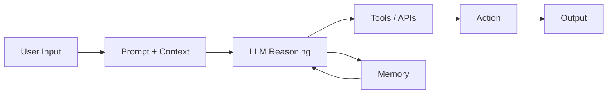

  <h1 align="center">🤖 Build AI Agents</h1>
  

    Design • Build • Integrate • Automate • Deploy Agentic AI
  

---

  
  
  
  

---

## Overview

Agentic AI represents the next evolution of artificial intelligence —  
systems that can **reason, decide, and act autonomously to achieve goals**.

**Build AI Agents** is a hands-on program designed to teach you how to design, build, and deploy intelligent agents using no-code and low-code tools.

By the end of this course, you will have built:

- ✅ Multiple functional AI agents  
- ✅ Agents with memory and tools  
- ✅ Agents connected to real data  
- ✅ Multi-agent workflows  
- ✅ Automated business processes  
- ✅ A final production-style agent prototype  

This course focuses on **real-world applications**, not theory only.

You will learn how to design agents that can:

- automate workflows  
- interact with data  
- collaborate with other agents  
- operate safely and reliably  
- deliver business value

---

# Technology Stack

🤖 GPTs Builder • 🔗 Flowise AI • 📊 Google Sheets  
⚡ Zapier • Slack • APIs  
🧠 LLMs • Prompt Engineering • Vector Memory  
🛠 No-Code / Low-Code Agent Platforms  

---

# Agent Architecture You Will Build

## Program Roadmap
| Module | Lab |
|--------|------|
| [Introduction to the Agentic AI Era](https://github.com/ga-curriculum/introduction-to-the-agentic-ai-era) | [Concept Mapping](https://ga-curriculum.github.io/introduction-to-the-agentic-ai-era/) |
| [Anatomy of an Agent](https://github.com/ga-curriculum/anatomy-of-an-agent) | [Visual Data Flow Prototype](https://ga-curriculum.github.io/anatomy-of-an-agent/) |
| [How Agents Work](https://github.com/ga-curriculum/how-agents-work) | [Support Agent Anatomy](https://ga-curriculum.github.io/how-agents-work/) |
| [Current Agentic AI Frameworks and Ecosystems](https://github.com/ga-curriculum/current-agentic-ai-frameworks-and-ecosystems) | [Platform Comparison Canvas](https://ga-curriculum.github.io/current-agentic-ai-frameworks-and-ecosystems/) |
| [Use Cases Across Industries](https://github.com/ga-curriculum/use-cases-across-industries) | [Case Analysis with Technical Lens](https://ga-curriculum.github.io/use-cases-across-industries/) |
| [Prompts, Intents, and Context](https://github.com/ga-curriculum/prompts-intents-and-context) | [Structured Prompt Crafting](https://ga-curriculum.github.io/prompts-intents-and-context/) |
| [Tools and Actions](https://github.com/ga-curriculum/tools-and-actions) | [Tool Integration Challenge](https://ga-curriculum.github.io/tools-and-actions/) |
| [Memory and Learning](https://github.com/ga-curriculum/memory-and-learning) | [Conversational Memory Implementation](https://ga-curriculum.github.io/memory-and-learning/) |
| [Multi-Agent Coordination](https://github.com/ga-curriculum/multi-agent-coordination) | [Agent Team Simulation](https://ga-curriculum.github.io/multi-agent-coordination/) |
| [Integration with Business Data](https://github.com/ga-curriculum/integration-with-business-data) | [Secure Integration Project](https://ga-curriculum.github.io/integration-with-business-data/) |
| [Task Automation with Agents](https://github.com/ga-curriculum/task-automation-with-agents) | [Process Automation Plan](https://ga-curriculum.github.io/task-automation-with-agents/) |
| [Agent UX and Interaction](https://github.com/ga-curriculum/agent-ux-and-interaction) | [Dialogue Design](https://ga-curriculum.github.io/agent-ux-and-interaction/) |
| [Risks and Security](https://github.com/ga-curriculum/risks-and-security) | [Agent Security Audit](https://ga-curriculum.github.io/risks-and-security/) |
| [Building Your First Full Agent](https://github.com/ga-curriculum/building-your-first-full-agent) | [Functional Prototype](https://ga-curriculum.github.io/building-your-first-full-agent/) |
| [Monitoring and Orchestration](https://github.com/ga-curriculum/monitoring-and-orchestration) | [Log Analysis and Refinement](https://ga-curriculum.github.io/monitoring-and-orchestration/) |
| [Final Presentation and Future of Agentic AI](https://github.com/ga-curriculum/capstone-and-future-of-agentic-ai) | [Final Project Demonstration](https://ga-curriculum.github.io/capstone-and-future-of-agentic-ai/) |

---

## What You Will Learn

✔ What makes Agentic AI different from generative AI  
✔ How agents think, act, and use tools  
✔ How to design reliable prompts  
✔ How to give agents memory  
✔ How to connect agents to real data  
✔ How to automate workflows  
✔ How to build multi-agent systems  
✔ How to secure and monitor agents  
✔ How to build a complete agent from scratch  

---

## Final Capstone

At the end of the course, you will build:

✅ A fully functional AI agent  
✅ With memory  
✅ With tools  
✅ With automation  
✅ With safety guardrails  
✅ With real-world use case  

---

## Course Setup Checklist

### Requirements

- Stable internet connection  
- Modern browser (Chrome recommended)  
- Google account  
- GitHub account  
- OpenAI account  

---

### Accounts Needed

- OpenAI / ChatGPT  
- Google Sheets  
- Zapier  
- Slack (optional)  
- Flowise / agent builder tool  

---

### Recommended Skills

Not required, but helpful:

- Basic computer skills  
- Curiosity about AI  
- Interest in automation  
- Interest in business workflows  

No coding required.

---

<b>Design agents. Automate work. Build the future.</b>

---

*General Assembly · Build AI Agents · BAA · © 2026*
