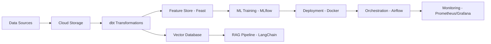

<p align="center">
  <h1 align="center">Data Engineering & Automation with AI</h1>
  <p align="center">
    Build • Automate • Scale • Deploy • Monitor
  </p>
</p>

---

<p align="center">
  
  
  
  
</p>

---

## Overview

Artificial intelligence is only as powerful as the data that fuels it.

**Data Engineering & Automation with AI** is a hands-on program designed to teach you how to design, build, automate, and deploy production-ready AI data pipelines.

By the end of this course, you will have built:

- ✅ A cloud-deployed data platform  
- ✅ Automated orchestration workflows  
- ✅ ML lifecycle management  
- ✅ RAG integration  
- ✅ Infrastructure as Code provisioning  
- ✅ Monitoring and governance dashboards  

---

# Technology Stack

<p align="center">

🐍 Python • 🌬 Apache Airflow • 📡 Apache Kafka • 🧱 dbt • ⚡ Apache Spark  
🐳 Docker & Kubernetes • 🏗 Terraform • 📊 MLflow  
🧠 Vector Databases • 🔗 LangChain

</p>

---

# Architecture You Will Build



---

# Program Roadmap

Below is how each module maps to a hands-on lab and the primary tools used.  
This is the construction blueprint of your final capstone system.

```python?code_reference&code_event_index=2
import re

table_content = """
| Module Name | Associated Lab | Tool(s) Used |
|---|---|---|
| [Introduction to AI-Powered Data Engineering](https://github.com/ga-curriculum/Introduction-to-AI-Powered-Data-Engineering) | [Mapping the AI Data Lifecycle](https://github.com/ga-curriculum/Lab-1-Mapping-the-AI-Data-Lifecycle) | Python, GitHub, VS Code, AWS/GCP |
| [Cloud Data Storage and Architecture Design](https://github.com/ga-curriculum/Cloud-Data-Storage-and-Architecture-Design) | [Setting Up Cloud Storage and Data Warehousing](https://github.com/ga-curriculum/Lab-2-Setting-Up-Cloud-Storage-and-Data-Warehousing) | AWS/GCP, Snowflake/BigQuery, SQL |
| [Data Ingestion and Pipeline Basics](https://github.com/ga-curriculum/Data-Ingestion-and-Pipeline-Basics) | [Batch Data Ingestion Pipeline](https://github.com/ga-curriculum/Lab-3-Batch-Data-Ingestion-Pipeline) | Python, REST APIs, SQL |
| [Streaming Data Pipelines With Kafka](https://github.com/ga-curriculum/Streaming-Data-Pipelines-With-Kafka) | [Streaming Real-Time Data With Kafka](https://github.com/ga-curriculum/Lab-4-Streaming-Real-time-Data-with-Kafka) | Apache Kafka, Python |
| [Building Data Models With dbt](https://github.com/ga-curriculum/Building-Data-Models-With-dbt) | [Transforming Data With dbt](https://github.com/ga-curriculum/Lab-5-Transforming-Data-with-dbt) | dbt, GitHub |
| [Scalable Processing With Apache Spark](https://github.com/ga-curriculum/Scalable-Processing-With-Apache-Spark) | [Scalable Processing With Apache Spark](https://github.com/ga-curriculum/Lab-6-Scalable-Processing-with-Apache-Spark) | Apache Spark, Databricks, PySpark |
| [Workflow Automation With Airflow](https://github.com/ga-curriculum/Workflow-Automation-With-Airflow) | [Workflow Automation With Airflow](https://github.com/ga-curriculum/Lab-7-Workdlow-Automation-with-Airflow) | Airflow, Docker |
| [Airflow Advanced + MLflow Integration](https://github.com/ga-curriculum/Airflow-Advanced-MLflow-Integration/) | [Airflow Advanced MLflow Integration](https://github.com/ga-curriculum/Lab-8-Airflow-Advanced-MLflow-Integration) | Airflow, MLflow |
| [Vector Databases and Embeddings](https://github.com/ga-curriculum/Vector-Databases-and-Embeddings) | [Vector Databases and Embeddings](https://github.com/ga-curriculum/Lab-9-Vector-Databases-and-Embeddings) | Python, ChromaDB/Pinecone |
| [RAG Pipeline With LangChain](https://github.com/ga-curriculum/RAG-Pipeline-With-LangChain) | [Building a Production RAG System](https://github.com/ga-curriculum/Lab-10-Building-a-Production-RAG-System) | LangChain, OpenAI API |
| [Feature Store Management With Feast](https://github.com/ga-curriculum/Feature-Store-Management-With-Feast) | [Building a Feature Store With Feast](https://github.com/ga-curriculum/Lab-11-Building-a-Feature-Store-with-Feast) | Feast, Python |
| [Deploying Data Jobs With Docker](https://github.com/ga-curriculum/Deploying-Data-Jobs-With-Docker) | [Containerizing a Data Pipeline With Docker](https://github.com/ga-curriculum/Lab-12-Containerizing-a-Data-Pipeline-with-Docker) | Docker, Kubernetes |
| [Infrastructure as Code With Terraform](https://github.com/ga-curriculum/Infrastructure-as-Code-With-Terraform) | [Building Data Infrastructure With Terraform](https://github.com/ga-curriculum/Lab-13-Building-Data-Infrastructure-with-Terraform) | Terraform, GitHub Actions |
| [Monitoring and Securing Data Pipelines](https://github.com/ga-curriculum/Monitoring-and-Securing-Data-Pipelines) | [Monitoring and Securing a Data Pipeline](https://github.com/ga-curriculum/Lab-14-Monitoring-and-Securing-a-Data-Pipeline) | Prometheus, Grafana, IAM |
| [Capstone: Build and Deploy a Fully Automated AI Data Pipeline](https://github.com/ga-curriculum/data-engineering-and-automation-with-ai-capstone) | Final Capstone Lab | Airflow, dbt, Spark, MLflow, Docker, Terraform, Prometheus |
"""

def to_lower_kebab(match):
    prefix = match.group(1)
    url = match.group(2)
    # Lowercase the entire URL
    new_url = url.lower()
    # Note: Kebab case usually implies replacing spaces/underscores with hyphens.
    # The existing URLs use hyphens but mixed case. Lowercasing them makes them lower-kebab.
    return f"({new_url})"

# Regex to find (url)
# Pattern: \((http[s]?://[^\)]+)\)
updated_table = re.sub(r'\((https?://[^\)]+)\)', to_lower_kebab, table_content)

print(updated_table)


```
```text?code_stderr&code_event_index=2
Traceback (most recent call last):
  File "<string>", line 34, in <module>
  File "re.py", line 209, in sub
    return _compile(pattern, flags).sub(repl, string, count)
  File "<string>", line 25, in to_lower_kebab
IndexError: no such group

```
```python?code_reference&code_event_index=5
import re

table_content = """
| Module Name | Associated Lab | Tool(s) Used |
|---|---|---|
| [Introduction to AI-Powered Data Engineering](https://github.com/ga-curriculum/Introduction-to-AI-Powered-Data-Engineering) | [Mapping the AI Data Lifecycle](https://github.com/ga-curriculum/Lab-1-Mapping-the-AI-Data-Lifecycle) | Python, GitHub, VS Code, AWS/GCP |
| [Cloud Data Storage and Architecture Design](https://github.com/ga-curriculum/Cloud-Data-Storage-and-Architecture-Design) | [Setting Up Cloud Storage and Data Warehousing](https://github.com/ga-curriculum/Lab-2-Setting-Up-Cloud-Storage-and-Data-Warehousing) | AWS/GCP, Snowflake/BigQuery, SQL |
| [Data Ingestion and Pipeline Basics](https://github.com/ga-curriculum/Data-Ingestion-and-Pipeline-Basics) | [Batch Data Ingestion Pipeline](https://github.com/ga-curriculum/Lab-3-Batch-Data-Ingestion-Pipeline) | Python, REST APIs, SQL |
| [Streaming Data Pipelines With Kafka](https://github.com/ga-curriculum/Streaming-Data-Pipelines-With-Kafka) | [Streaming Real-Time Data With Kafka](https://github.com/ga-curriculum/Lab-4-Streaming-Real-time-Data-with-Kafka) | Apache Kafka, Python |
| [Building Data Models With dbt](https://github.com/ga-curriculum/Building-Data-Models-With-dbt) | [Transforming Data With dbt](https://github.com/ga-curriculum/Lab-5-Transforming-Data-with-dbt) | dbt, GitHub |
| [Scalable Processing With Apache Spark](https://github.com/ga-curriculum/Scalable-Processing-With-Apache-Spark) | [Scalable Processing With Apache Spark](https://github.com/ga-curriculum/Lab-6-Scalable-Processing-with-Apache-Spark) | Apache Spark, Databricks, PySpark |
| [Workflow Automation With Airflow](https://github.com/ga-curriculum/Workflow-Automation-With-Airflow) | [Workflow Automation With Airflow](https://github.com/ga-curriculum/Lab-7-Workdlow-Automation-with-Airflow) | Airflow, Docker |
| [Airflow Advanced + MLflow Integration](https://github.com/ga-curriculum/Airflow-Advanced-MLflow-Integration/) | [Airflow Advanced MLflow Integration](https://github.com/ga-curriculum/Lab-8-Airflow-Advanced-MLflow-Integration) | Airflow, MLflow |
| [Vector Databases and Embeddings](https://github.com/ga-curriculum/Vector-Databases-and-Embeddings) | [Vector Databases and Embeddings](https://github.com/ga-curriculum/Lab-9-Vector-Databases-and-Embeddings) | Python, ChromaDB/Pinecone |
| [RAG Pipeline With LangChain](https://github.com/ga-curriculum/RAG-Pipeline-With-LangChain) | [Building a Production RAG System](https://github.com/ga-curriculum/Lab-10-Building-a-Production-RAG-System) | LangChain, OpenAI API |
| [Feature Store Management With Feast](https://github.com/ga-curriculum/Feature-Store-Management-With-Feast) | [Building a Feature Store With Feast](https://github.com/ga-curriculum/Lab-11-Building-a-Feature-Store-with-Feast) | Feast, Python |
| [Deploying Data Jobs With Docker](https://github.com/ga-curriculum/Deploying-Data-Jobs-With-Docker) | [Containerizing a Data Pipeline With Docker](https://github.com/ga-curriculum/Lab-12-Containerizing-a-Data-Pipeline-with-Docker) | Docker, Kubernetes |
| [Infrastructure as Code With Terraform](https://github.com/ga-curriculum/Infrastructure-as-Code-With-Terraform) | [Building Data Infrastructure With Terraform](https://github.com/ga-curriculum/Lab-13-Building-Data-Infrastructure-with-Terraform) | Terraform, GitHub Actions |
| [Monitoring and Securing Data Pipelines](https://github.com/ga-curriculum/Monitoring-and-Securing-Data-Pipelines) | [Monitoring and Securing a Data Pipeline](https://github.com/ga-curriculum/Lab-14-Monitoring-and-Securing-a-Data-Pipeline) | Prometheus, Grafana, IAM |
| [Capstone: Build and Deploy a Fully Automated AI Data Pipeline](https://github.com/ga-curriculum/data-engineering-and-automation-with-ai-capstone) | Final Capstone Lab | Airflow, dbt, Spark, MLflow, Docker, Terraform, Prometheus |
"""

def lower_kebab_url(match):
    url = match.group(1)
    # Lowercase everything
    url = url.lower()
    # Replace underscores with hyphens (if any exist)
    url = url.replace('_', '-')
    # Remove trailing slash if it exists before closing parenthesis
    if url.endswith('/'):
        url = url[:-1]
    return f"({url})"

# Use the regex to find URLs in markdown format
updated_table = re.sub(r'\((https?://[^\)]+)\)', lower_kebab_url, table_content)
print(updated_table)

```
```text?code_stdout&code_event_index=5

| Module Name | Associated Lab | Tool(s) Used |
|---|---|---|
| [Introduction to AI-Powered Data Engineering](https://github.com/ga-curriculum/introduction-to-ai-powered-data-engineering) | [Mapping the AI Data Lifecycle](https://github.com/ga-curriculum/lab-1-mapping-the-ai-data-lifecycle) | Python, GitHub, VS Code, AWS/GCP |
| [Cloud Data Storage and Architecture Design](https://github.com/ga-curriculum/cloud-data-storage-and-architecture-design) | [Setting Up Cloud Storage and Data Warehousing](https://github.com/ga-curriculum/lab-2-setting-up-cloud-storage-and-data-warehousing) | AWS/GCP, Snowflake/BigQuery, SQL |
| [Data Ingestion and Pipeline Basics](https://github.com/ga-curriculum/data-ingestion-and-pipeline-basics) | [Batch Data Ingestion Pipeline](https://github.com/ga-curriculum/lab-3-batch-data-ingestion-pipeline) | Python, REST APIs, SQL |
| [Streaming Data Pipelines With Kafka](https://github.com/ga-curriculum/streaming-data-pipelines-with-kafka) | [Streaming Real-Time Data With Kafka](https://github.com/ga-curriculum/lab-4-streaming-real-time-data-with-kafka) | Apache Kafka, Python |
| [Building Data Models With dbt](https://github.com/ga-curriculum/building-data-models-with-dbt) | [Transforming Data With dbt](https://github.com/ga-curriculum/lab-5-transforming-data-with-dbt) | dbt, GitHub |
| [Scalable Processing With Apache Spark](https://github.com/ga-curriculum/scalable-processing-with-apache-spark) | [Scalable Processing With Apache Spark](https://github.com/ga-curriculum/lab-6-scalable-processing-with-apache-spark) | Apache Spark, Databricks, PySpark |
| [Workflow Automation With Airflow](https://github.com/ga-curriculum/workflow-automation-with-airflow) | [Workflow Automation With Airflow](https://github.com/ga-curriculum/lab-7-workdlow-automation-with-airflow) | Airflow, Docker |
| [Airflow Advanced + MLflow Integration](https://github.com/ga-curriculum/airflow-advanced-mlflow-integration) | [Airflow Advanced MLflow Integration](https://github.com/ga-curriculum/lab-8-airflow-advanced-mlflow-integration) | Airflow, MLflow |
| [Vector Databases and Embeddings](https://github.com/ga-curriculum/vector-databases-and-embeddings) | [Vector Databases and Embeddings](https://github.com/ga-curriculum/lab-9-vector-databases-and-embeddings) | Python, ChromaDB/Pinecone |
| [RAG Pipeline With LangChain](https://github.com/ga-curriculum/rag-pipeline-with-langchain) | [Building a Production RAG System](https://github.com/ga-curriculum/lab-10-building-a-production-rag-system) | LangChain, OpenAI API |
| [Feature Store Management With Feast](https://github.com/ga-curriculum/feature-store-management-with-feast) | [Building a Feature Store With Feast](https://github.com/ga-curriculum/lab-11-building-a-feature-store-with-feast) | Feast, Python |
| [Deploying Data Jobs With Docker](https://github.com/ga-curriculum/deploying-data-jobs-with-docker) | [Containerizing a Data Pipeline With Docker](https://github.com/ga-curriculum/lab-12-containerizing-a-data-pipeline-with-docker) | Docker, Kubernetes |
| [Infrastructure as Code With Terraform](https://github.com/ga-curriculum/infrastructure-as-code-with-terraform) | [Building Data Infrastructure With Terraform](https://github.com/ga-curriculum/lab-13-building-data-infrastructure-with-terraform) | Terraform, GitHub Actions |
| [Monitoring and Securing Data Pipelines](https://github.com/ga-curriculum/monitoring-and-securing-data-pipelines) | [Monitoring and Securing a Data Pipeline](https://github.com/ga-curriculum/lab-14-monitoring-and-securing-a-data-pipeline) | Prometheus, Grafana, IAM |
| [Capstone: Build and Deploy a Fully Automated AI Data Pipeline](https://github.com/ga-curriculum/data-engineering-and-automation-with-ai-capstone) | Final Capstone Lab | Airflow, dbt, Spark, MLflow, Docker, Terraform, Prometheus |


```
Here is the updated table with all the links converted to lower kebab-case:

| Module Name | Associated Lab | Tool(s) Used |
|---|---|---|
| [Introduction to AI-Powered Data Engineering](https://github.com/ga-curriculum/introduction-to-ai-powered-data-engineering) | [Mapping the AI Data Lifecycle](https://github.com/ga-curriculum/lab-1-mapping-the-ai-data-lifecycle) | Python, GitHub, VS Code, AWS/GCP |
| [Cloud Data Storage and Architecture Design](https://github.com/ga-curriculum/cloud-data-storage-and-architecture-design) | [Setting Up Cloud Storage and Data Warehousing](https://github.com/ga-curriculum/lab-2-setting-up-cloud-storage-and-data-warehousing) | AWS/GCP, Snowflake/BigQuery, SQL |
| [Data Ingestion and Pipeline Basics](https://github.com/ga-curriculum/data-ingestion-and-pipeline-basics) | [Batch Data Ingestion Pipeline](https://github.com/ga-curriculum/lab-3-batch-data-ingestion-pipeline) | Python, REST APIs, SQL |
| [Streaming Data Pipelines With Kafka](https://github.com/ga-curriculum/streaming-data-pipelines-with-kafka) | [Streaming Real-Time Data With Kafka](https://github.com/ga-curriculum/lab-4-streaming-real-time-data-with-kafka) | Apache Kafka, Python |
| [Building Data Models With dbt](https://github.com/ga-curriculum/building-data-models-with-dbt) | [Transforming Data With dbt](https://github.com/ga-curriculum/lab-5-transforming-data-with-dbt) | dbt, GitHub |
| [Scalable Processing With Apache Spark](https://github.com/ga-curriculum/scalable-processing-with-apache-spark) | [Scalable Processing With Apache Spark](https://github.com/ga-curriculum/lab-6-scalable-processing-with-apache-spark) | Apache Spark, Databricks, PySpark |
| [Workflow Automation With Airflow](https://github.com/ga-curriculum/workflow-automation-with-airflow) | [Workflow Automation With Airflow](https://github.com/ga-curriculum/lab-7-workdlow-automation-with-airflow) | Airflow, Docker |
| [Airflow Advanced + MLflow Integration](https://github.com/ga-curriculum/airflow-advanced-mlflow-integration) | [Airflow Advanced MLflow Integration](https://github.com/ga-curriculum/lab-8-airflow-advanced-mlflow-integration) | Airflow, MLflow |
| [Vector Databases and Embeddings](https://github.com/ga-curriculum/vector-databases-and-embeddings) | [Vector Databases and Embeddings](https://github.com/ga-curriculum/lab-9-vector-databases-and-embeddings) | Python, ChromaDB/Pinecone |
| [RAG Pipeline With LangChain](https://github.com/ga-curriculum/rag-pipeline-with-langchain) | [Building a Production RAG System](https://github.com/ga-curriculum/lab-10-building-a-production-rag-system) | LangChain, OpenAI API |
| [Feature Store Management With Feast](https://github.com/ga-curriculum/feature-store-management-with-feast) | [Building a Feature Store With Feast](https://github.com/ga-curriculum/lab-11-building-a-feature-store-with-feast) | Feast, Python |
| [Deploying Data Jobs With Docker](https://github.com/ga-curriculum/deploying-data-jobs-with-docker) | [Containerizing a Data Pipeline With Docker](https://github.com/ga-curriculum/lab-12-containerizing-a-data-pipeline-with-docker) | Docker, Kubernetes |
| [Infrastructure as Code With Terraform](https://github.com/ga-curriculum/infrastructure-as-code-with-terraform) | [Building Data Infrastructure With Terraform](https://github.com/ga-curriculum/lab-13-building-data-infrastructure-with-terraform) | Terraform, GitHub Actions |
| [Monitoring and Securing Data Pipelines](https://github.com/ga-curriculum/monitoring-and-secure-data-pipelines) | [Monitoring and Securing a Data Pipeline](https://github.com/ga-curriculum/lab-14-monitoring-and-securing-a-data-pipeline) | Prometheus, Grafana, IAM |
| [Capstone: Build and Deploy a Fully Automated AI Data Pipeline](https://github.com/ga-curriculum/data-engineering-and-automation-with-ai-capstone) | Final Capstone Lab | Airflow, dbt, Spark, MLflow, Docker, Terraform, Prometheus |
---

# Course Setup Checklist

Before Day 1, ensure everything below is installed and working.

---

## System Requirements

- [ ] 8GB RAM minimum (16GB recommended)
- [ ] 40GB free disk space
- [ ] Stable broadband internet
- [ ] Windows 11 / macOS (last 2 versions) / Ubuntu LTS

---

## Core Development Tools

- [ ] Install Visual Studio Code
- [ ] Install Python 3.10+
- [ ] Confirm Python works  
  ```bash
  python --version
  ```
- [ ] Confirm pip works  
  ```bash
  pip --version
  ```
- [ ] Install Git
- [ ] Create or confirm access to GitHub

---

## Python Packages

### Data Processing
```bash
pip install pandas numpy requests sqlalchemy
```

### Orchestration & Pipelines
```bash
pip install apache-airflow kafka-python dbt-core
```

### Distributed Processing
```bash
pip install pyspark
```

### ML Lifecycle & Features
```bash
pip install mlflow feast
```

### Generative AI & RAG
```bash
pip install langchain chromadb openai
```

---

## Containers & Infrastructure

- [ ] Install Docker Desktop
- [ ] Enable Kubernetes
- [ ] Confirm Docker works  
  ```bash
  docker --version
  ```
- [ ] Install Terraform
- [ ] Confirm Terraform works  
  ```bash
  terraform --version
  ```

---

## Required Accounts

- [ ] AWS or GCP account
- [ ] Databricks Community Edition account
- [ ] OpenAI API key
- [ ] GitHub account

---

<p align="center">
  <b>Build real systems. Automate intelligently. Deploy with confidence.</b>
</p>
